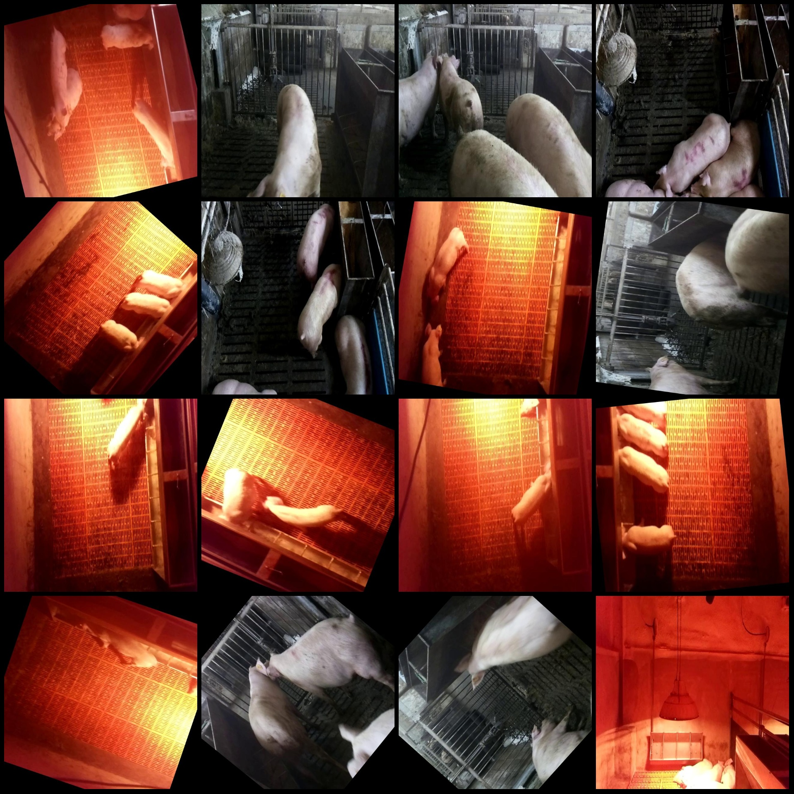
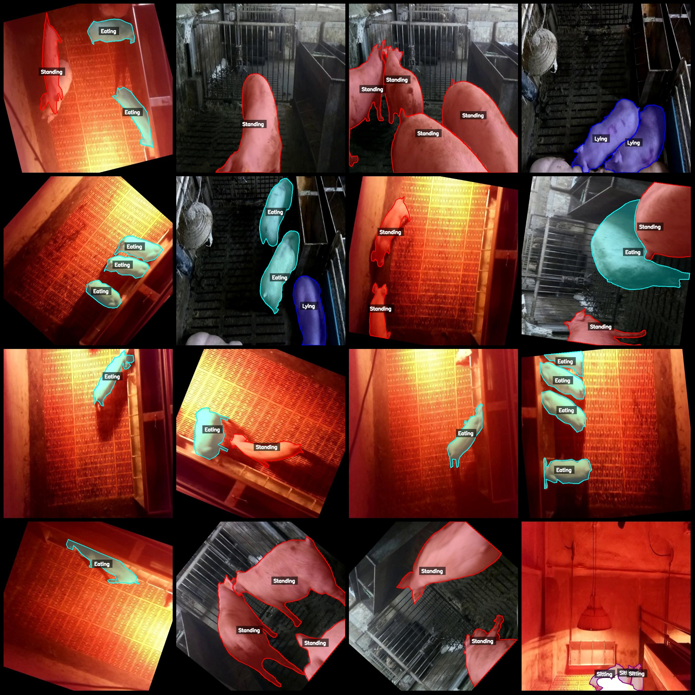

# Smart Farming Pig Behavior Identification and Segmentation Dataset (labelme format)

1085 images in total, including about 450 original images and the remaining enhanced ones mainly through rotation enhancement.

Dataset format: labelme (without mask files, only containing jpg images and corresponding json files).

Number of images (number of jpg files): 1085
Number of annotations (json file count): 1085
Number of annotation categories: 4
Annotation category names: ["Standing", "Sitting", "Eating", "Lying"]
Number of bounding boxes per category:
Standing count = 1056
Sitting count = 483
Eating count = 759
Lying count = 578
Total number of bounding boxes: 2876

Annotation tool used: labelme v5.5.0
Image resolution: 640x640
Annotation rules: draw polygons for each category

Important note: This dataset can be opened and edited using labelme, but the json dataset needs to be converted into either Yolo or COCO format for semantic segmentation or instance segmentation.

Special declaration: This dataset does not guarantee the accuracy of the trained models or weight files.

Image preview: 
Annotation examples:
Randomly selected 16 images for annotation:
Annotation drawing results:
Labelme editing image example:

## Images

Here is a pay link on Stripe ( https://buy.stripe.com/3cs8yP7sY87d0vu9AB ). Please contact me lonlonago@foxmail.com after funding $89, and I will send you a complete data files , thank you!

